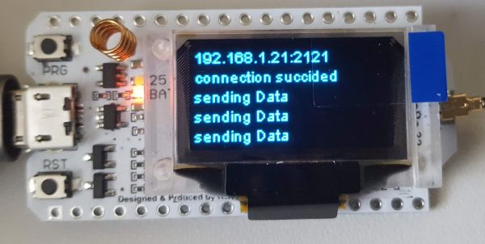
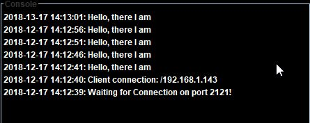

## Testprogram for Heltec Wifi Lora 32

Scan the network and write a list on the display.

 

## Libs
https://github.com/ThingPulse/esp8266-oled-ssd1306

## Further Informations
Visit https://wwww.fambach.net (if you want)

