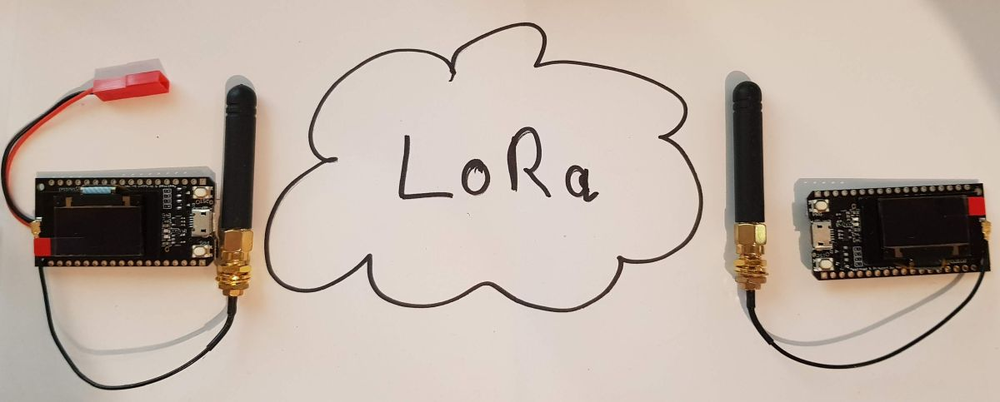

## Receiver for TTGO LoRa ESP 32 Oled Board
 

##Folders
img - Pictures
src - examples

## Libs
https://github.com/sandeepmistry/arduino-LoRa 
https://github.com/ThingPulse/esp8266-oled-ssd1306

## License 
For more Invormations Visit http://www.fambach.net
