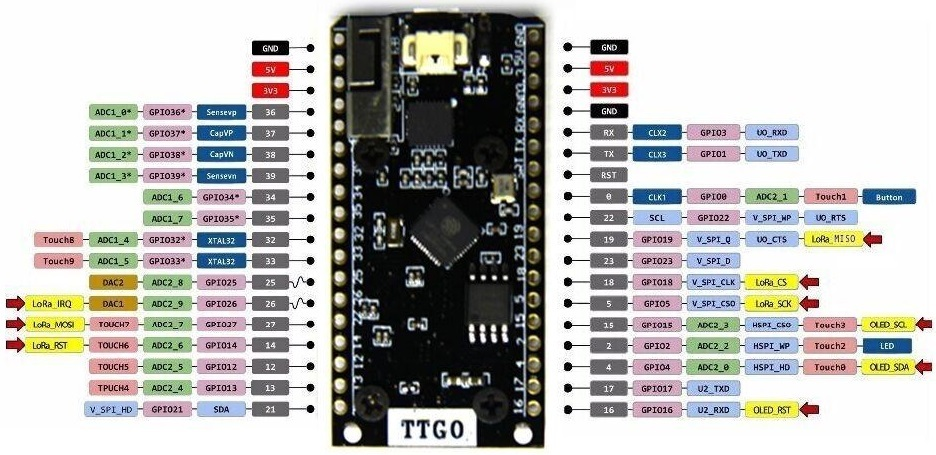

## Receiver for TTGO LoRa ESP 32 Oled Board
 

##Folders

img - Pictures  
src - Examples  
lib - Libraries  

## Libs
https://github.com/sandeepmistry/arduino-LoRa  
https://github.com/ThingPulse/esp8266-oled-ssd1306

## License 
For more Invormations Visit http://www.fambach.net
