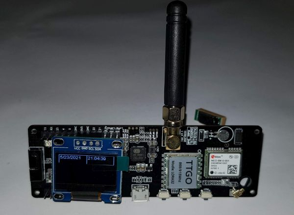

# LILYGO TTGO T Beam
I wrote some small test programms for all parts of the T-Beam

## The following program are included

LoraReceiver

LoraSender

DisplayTest

GPSTest

ButtonTest

BatteryStatusTest

BatteryStatusDisplay

## Used Libs

## Credits
Created by S. Fambach visit https://www.fambach.net if you want

