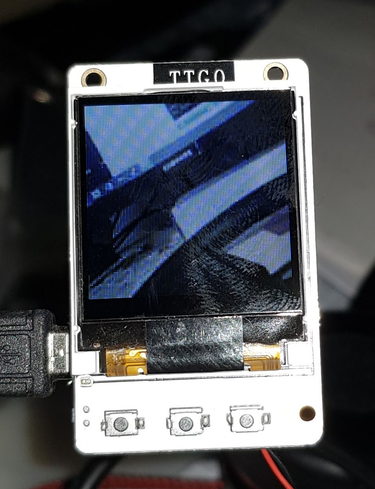

# Use the TTGO Ts V1.2 as a jpeg viewer
In the current example I read continiously jpegs from the ESP 32 Cam.
All setup information is located in the secrets.h, where you can
enter jpeg location and your wifi settings.

## Used Hardware

TTGO Ts V1.2 as viewer
ESP 32 Cam as jpeg producer (with standard software) 
https://github.com/espressif/esp32-camera

## Used Libs

https://github.com/adafruit/Adafruit-GFX-Library

https://github.com/adafruit/Adafruit-ST7735-Library

https://github.com/adafruit/Adafruit-GFX-Library

Visit my website https://www.fambach.net/?p=5532 for more informations

